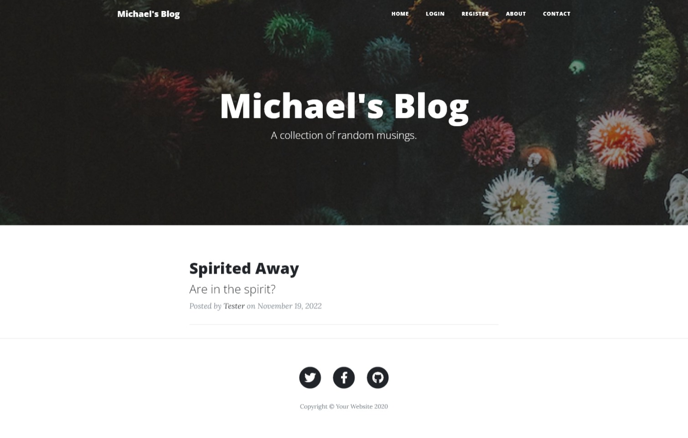

# Blog with Python Flask

## Description
This project is a blog website that allows regular users to sign-up and read different blog posts.
There is an option for admins of the blog to create their own blog posts and delete the post.

### Technologies Used
- Flask: used for templating the website
- SQLite: used for storing blog posts in a database and storing users
- WTForms: used for creating new blog posts
- BootStrap: used for styling

### Challenges Faced
- Using Flask, Jinja and SQLite together for the first time was difficult at first
- While testing the code the database can build up quickly and entries needed to constantly be deleted
- Authorization for admins took time to understand how to make it work properly and avoid having all users access to
admin only routes

### Future Features
- Add sorting for blog posts
- Add categories for different types of blog posts

## Getting Started
Open http://127.0.0.1:5000 with your browser to see the blog page.

